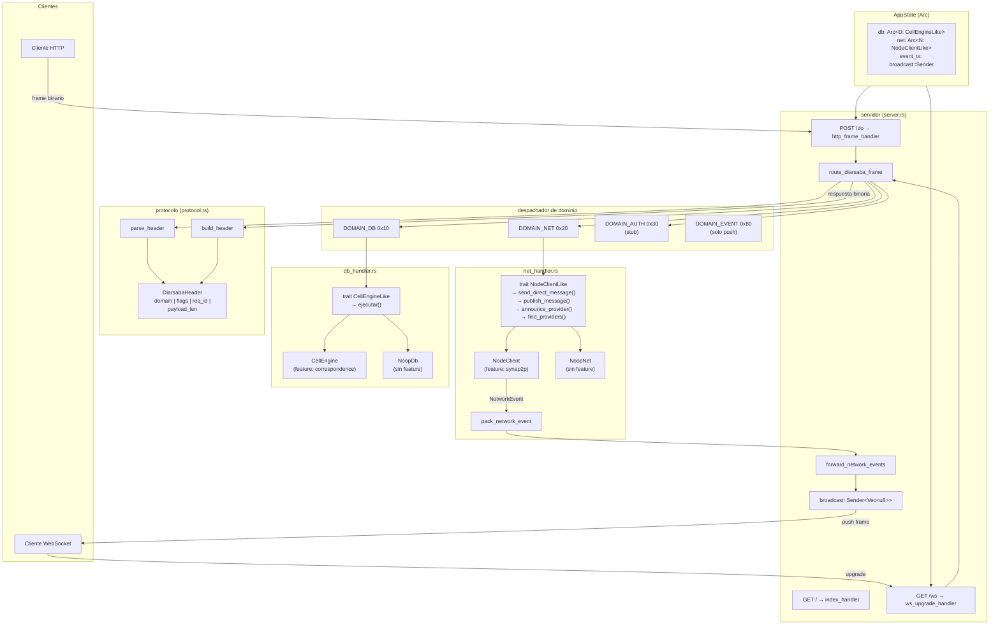
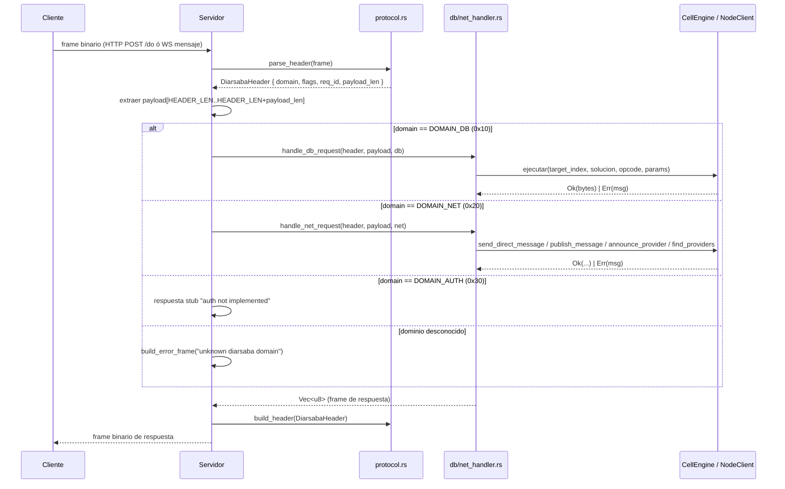
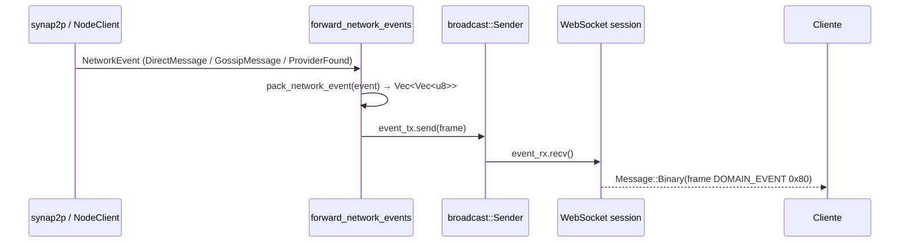
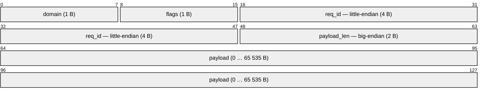
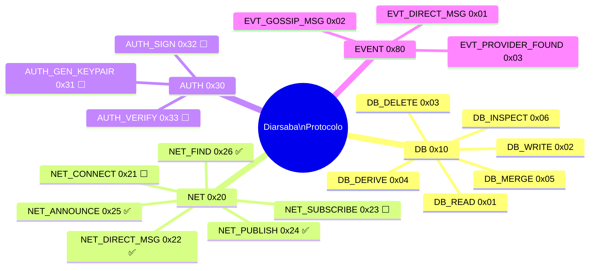
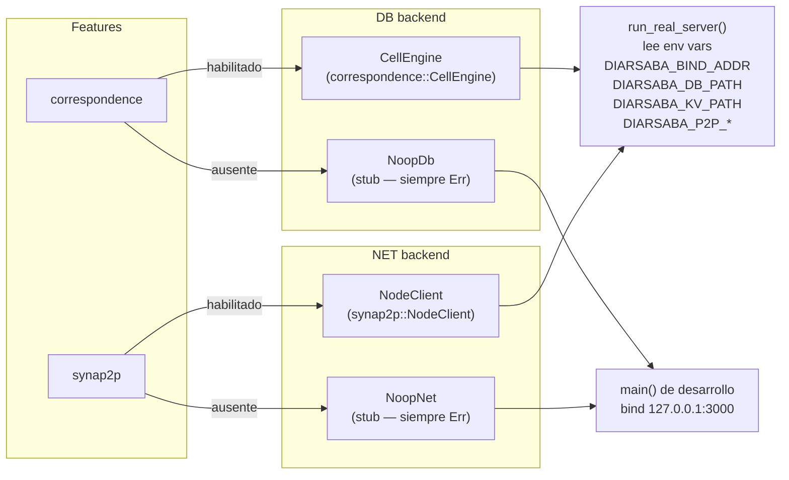

# Diagrama de Arquitectura — Diarsaba

## 1. Arquitectura general

## 2. Flujo de un frame de request/response

## 3. Flujo de eventos push (WebSocket)

## 4. Estructura del frame binario

## 5. Dominios y opcodes

## 6. Modos de compilación (features)

